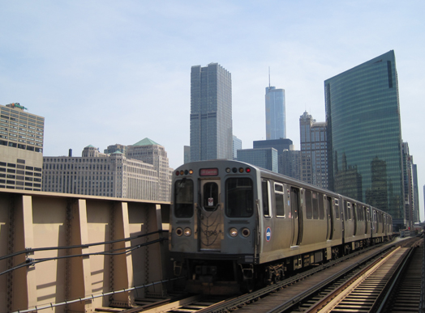
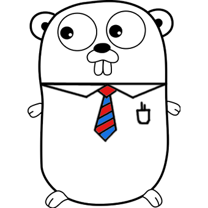

# GoCTA

A Golang wrapper for the Chicago Transit Authority Train API.

### Motivation

I want to be able to track the arrival times of the train near
my apartment from the command line, my i3 status bar, or through
Acme. I haven't really decided yet but they all need data in
plain text. The reason why I chose Go instead of some scripting
language was that I just wanted to get more familiar with the
language and its tooling.

### What's implemented?

* A parser that parses the XML responses from the API.
* A sample command that uses the parser on XML responses
  coming from standard input (to be piped with curl).

### What's on the TODO list?

* A command that reads your API key and station (set up as
  environment variables) and communicates with the API
  giving estimations for your station every X seconds.
* Doc doc doc
* Have a local copy of the API
* Screenshots of cmd commands
* TravisCI or equivalent integration just to try it out
* Add Makefile with coverage, benchmarking, etc... commands

